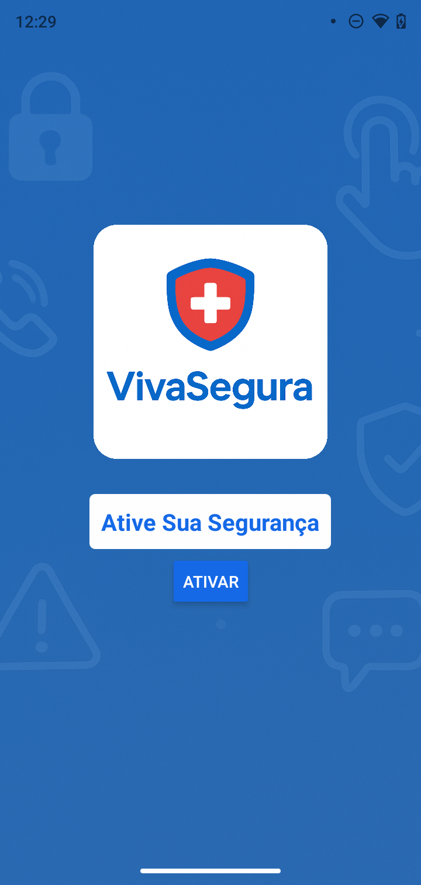
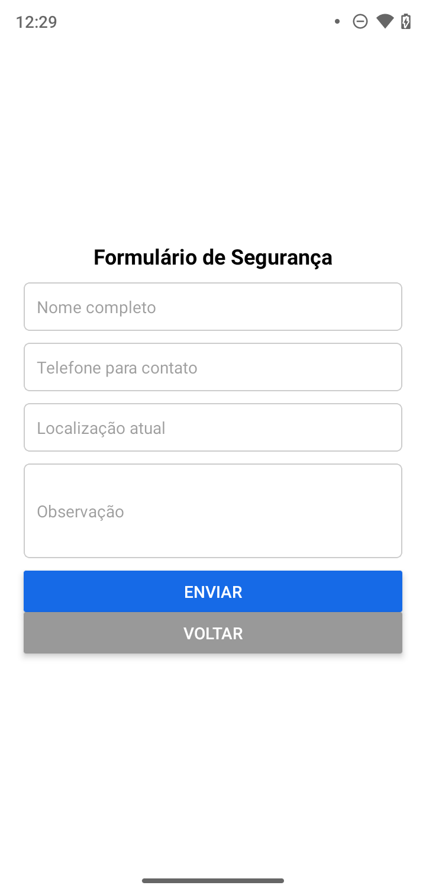

# Projeto VivaSegura


## 📲 Capturas de Tela
                                          | HOME | FORMULÁRIO|
<p align="center">
  
  
</p>


## Descrição
Aplicativo mobile desenvolvido com **React Native** e **Expo**, com foco em:  

- Navegação entre telas com **React Navigation Stack**  
- Formulário funcional para coleta de dados do usuário  
- Gerenciamento de estado interno com **useState**  
- StatusBar personalizada e interface limpa sem cabeçalhos  

O app é ideal para aprendizado de React Native, formulários, e navegação básica.

---

## Tecnologias e Dependências

- [React Native](https://reactnative.dev/)
- [Expo](https://expo.dev/)
- [React Navigation](https://reactnavigation.org/)
- **JavaScript / JSX**
- **Hooks do React** (`useState`, `useEffect`)
- Dependências necessárias:
```bash
npm install @react-navigation/native @react-navigation/stack react-native-gesture-handler react-native-reanimated react-native-screens react-native-safe-area-context


Estrutura do Projeto

VivaSegura/
├── App.tsx
├── package.json
├── src/
│   └── screens/
│       ├── HomeScreen.tsx
│       └── FormScreen.tsx
└── assets/
    ├── logo-vivaSegura.png
    └── Vivasegura-imagem-fundo.png


Uso do Aplicativo

- HomeScreen.tsx

Tela inicial com mensagem de boas-vindas.

Botão para navegar para o formulário.

- FormScreen.tsx

Digite nome e email.

Clique em Enviar para ver alerta de confirmação.

Após envio, navega de volta para a HomeScreen.


Executando no Android e iOS

Android:

Configure emulador no Android Studio.

Execute npm start e selecione "Run on Android device/emulator".

iOS:

Configure simulador no Xcode (MacOS).

Execute npm start e selecione "Run on iOS simulator".

Dispositivo físico:

Instale Expo Go e escaneie o QR Code do terminal.


